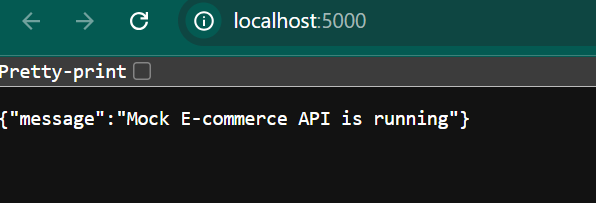
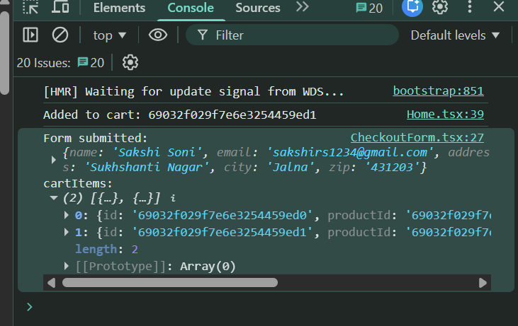
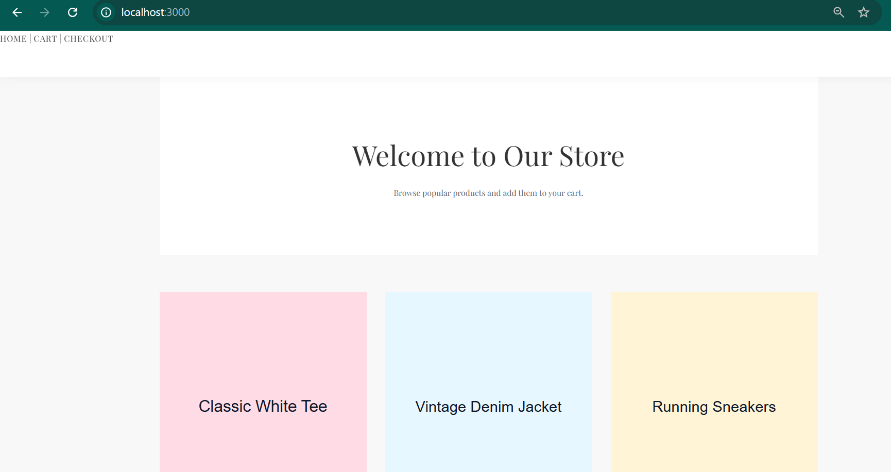
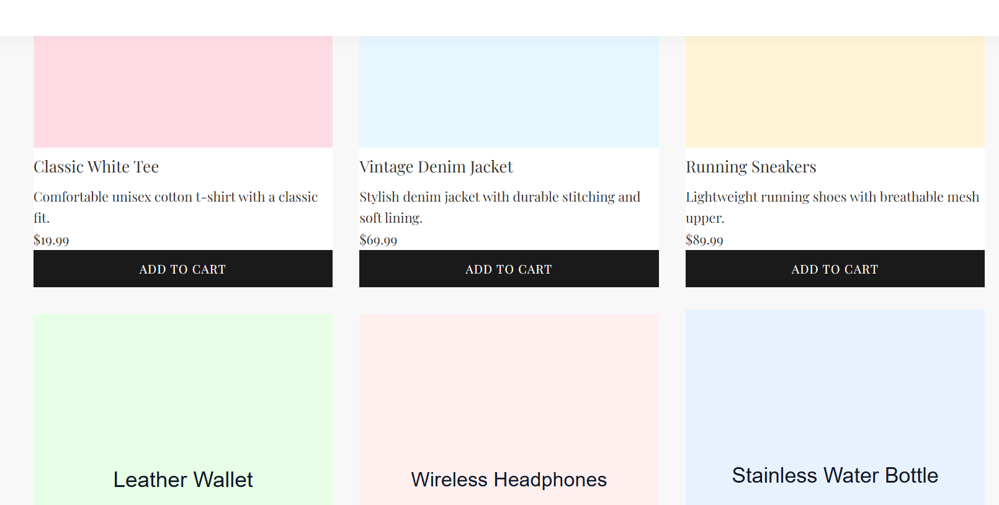

# Mock E-commerce Shopping Cart Application

This project is a full-stack e-commerce shopping cart application built using React for the frontend, Node.js with Express for the backend, and MongoDB or SQLite for the database. The application allows users to browse products, add them to a shopping cart, and proceed to checkout.

## Features

- **User Authentication**: Users can register and log in to their accounts.
- **Product Browsing**: Users can view a list of products with details.
- **Shopping Cart**: Users can add products to their cart, view cart contents, and remove items.
- **Checkout Process**: Users can complete their purchase through a checkout form.
- **Responsive Design**: The application is designed to be responsive and user-friendly.

## Technologies Used

- **Frontend**: React, TypeScript, CSS
- **Backend**: Node.js, Express, TypeScript
- **Database**: MongoDB or SQLite
- **State Management**: React Context API or custom hooks

## Project Structure

```
mock-ecommerce-assignment
├── backend
│   ├── src
│   │   ├── app.ts
│   │   ├── server.ts
│   │   ├── routes
│   │   │   ├── products.ts
│   │   │   ├── cart.ts
│   │   │   ├── users.ts
│   │   │   └── orders.ts
│   │   ├── controllers
│   │   │   ├── productController.ts
│   │   │   ├── cartController.ts
│   │   │   ├── userController.ts
│   │   │   └── orderController.ts
│   │   ├── models
│   │   │   ├── product.model.ts
│   │   │   ├── user.model.ts
│   │   │   ├── cart.model.ts
│   │   │   └── order.model.ts
│   │   ├── db
│   │   │   ├── index.ts
│   │   │   ├── mongo.ts
│   │   │   └── sqlite.ts
│   │   ├── middlewares
│   │   │   └── auth.ts
│   │   ├── services
│   │   │   └── payment.ts
│   │   └── utils
│   │       └── validators.ts
│   ├── package.json
│   ├── tsconfig.json
│   └── .env.example
├── frontend
│   ├── package.json
│   ├── tsconfig.json
│   ├── public
│   │   └── index.html
│   └── src
│       ├── index.tsx
│       ├── App.tsx
│       ├── pages
│       │   ├── Home.tsx
│       │   ├── ProductPage.tsx
│       │   ├── CartPage.tsx
│       │   └── CheckoutPage.tsx
│       ├── components
│       │   ├── ProductList.tsx
│       │   ├── ProductCard.tsx
│       │   ├── ProductDetail.tsx
│       │   ├── Cart.tsx
│       │   ├── CheckoutForm.tsx
│       │   └── Auth
│       │       ├── Login.tsx
│       │       └── Register.tsx
│       ├── services
│       │   └── api.ts
│       ├── hooks
│       │   └── useCart.ts
│       └── state
│           └── store.ts
├── .gitignore
└── README.md
```

## Getting Started

### Prerequisites

- Node.js
- npm or yarn
- MongoDB or SQLite (depending on your choice)

### Installation

1. Clone the repository:
   ```
   git clone <repository-url>
   cd mock-ecommerce-assignment
   ```

2. Install backend dependencies:
   ```
   cd backend
   npm install
   ```

3. Install frontend dependencies:
   ```
   cd frontend
   npm install
   ```

### Configuration

1. Create a `.env` file in the `backend` directory based on the `.env.example` file and configure your database connection.

### Running the Application

1. Start the backend server:
   ```
   cd backend
   npm run start
   ```

2. Start the frontend application:
   ```
   cd frontend
   npm run start
   ```

### Troubleshooting

If you see an error like:
'react-scripts' is not recognized as an internal or external command, operable program or batch file.

Do the following in a terminal.

1) Install frontend dependencies (run from the frontend folder):
```bash
cd f:\Nexora\mock-ecommerce-assignment\frontend
npm install
npm start
```

2) If the problem persists, clean and reinstall:
```bash
cd f:\Nexora\mock-ecommerce-assignment\frontend
rd /s /q node_modules          # Windows (PowerShell/CMD)
del package-lock.json
npm cache clean --force
npm install
npm start
```
(Unix/macOS equivalent: rm -rf node_modules package-lock.json && npm cache clean --force && npm install)

3) As a last resort (not recommended), install react-scripts globally:
```bash
npm install -g react-scripts@4.0.3
npm start
```

4) If you still have issues, share these outputs so I can help further:
- The full output of `npm install`
- The full output of `npm start`
- `node -v` and `npm -v`

# Screenshots



